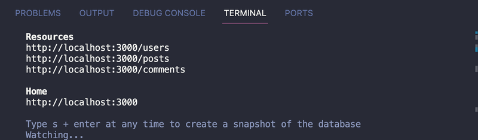
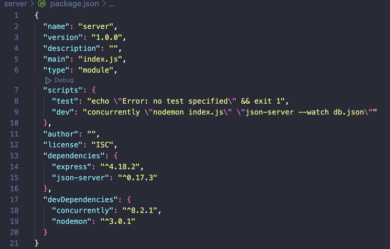
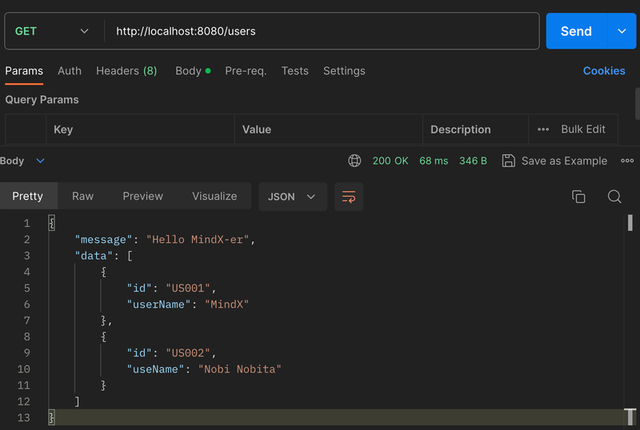

# To install JSON Server, we will use the command:
- npm install -g json-server
ℹ -g is a command to install the entire range of a computer

# Explain db.json file and json-server:
- a format of JSON is same as object, so we can see that there is a {} surrounding keys and values inside.
- Each of the first keys, it will be call that is a resource:
1. users: danh sách chứa thông tin id và tên của user
2. posts: danh sách các bài post của một user bao gồm: id của bài post, content của bài post, authorId là id của user đã tạo bài post này
3. comments: chưa các comment (bình luận) của các bài post bao gồm: id của comment, postId là id của bài post, content là nội dung của comment, authorId là id của user đã comment.

# Để chạy json-server ta sẽ sử dụng lệnh:
- json-server --watch db.json
- Khi chạy thư viện json-server, thư viện sẽ giúp chung ta tạo ra một server database với chuẩn RESTful API, sử dụng file json như một CSDL.

- Hãy thử truy cập các đường dẫn hiển thị trong terminal!

# Concurrently
- Khi muốn chạy server Express và Json server, ta sẽ phải chạy câu lệnh riêng biệt:

- node index.js

- json-server --watch db.json

- Để đỡ tốn thời gian, ta sẽ cần thực thi được 2 câu lệnh này đồng thời và nhanh chóng!

- Concurrently là một thư viện giúp chúng ta chạy nhiều câu lệnh đồng thời.

- Để cài đặt, ta sử dụng câu lệnh:

- npm i concurrently --save-dev

- --save-dev: là lệnh cấu hình rằng thư viện này ta chỉ sử dụng ở trong môi trường dev (develop), khi triển khai trên môi trường production sẽ không cần dùng thư viện này

# Nodemon
- Nodemon là một thư viện, hỗ trợ trong quá trình phát triển bằng cách restart lại server mỗi khi có sự thay đổi.

- Cài đặt thư viện bằng cách sử dụng câu lệnh

- npm i nodemon --save-dev

- Thay đổi câu lệnh node index.js bằng nodemon index.js và chạy câu lệnh npm run dev

# Cấu hình các lệnh script chỉ cần sử dụng npm run <name-scripts>
 - Ở đây tôi đặt tên là dev thì chỉ cần gọi lệnh "npm run dev" nó sẽ chạy các scripts bên trong.

# ExpressJS and Json Server
- Để kết nối được tới json-server, ta cần phải biết, json-server là một server và khi kết nối sẽ mất thời gian. Vậy ta sẽ cần phải sử dụng kiến thức về bất đồng bộ.

- Thực hiện viết API kết nối với resource users:

# Error Handling
1. Validation - xác thực dữ liệu
2. Middleware - Là một cách validation, nhưng trước hoặc sau handler function tách biệt riêng dùng để ghi lại, xử lý hoặc phản hồi cho người dùng cho các lỗi có thể chủ động nắm bắt được từ lập trình viên. (next lesson)
3. Status code - là các mã trả về cho client để thông báo dạng lỗi,..
